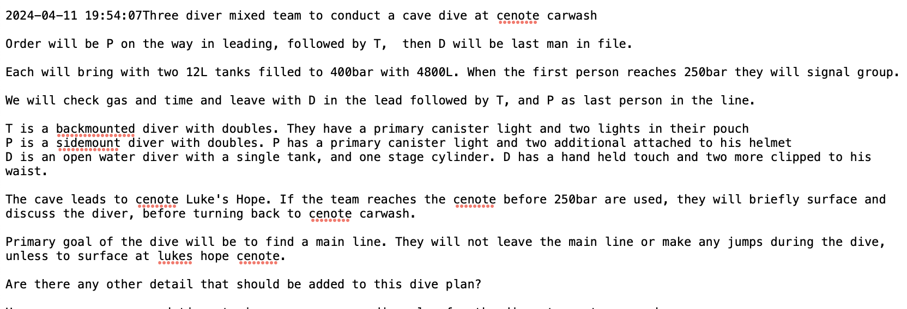
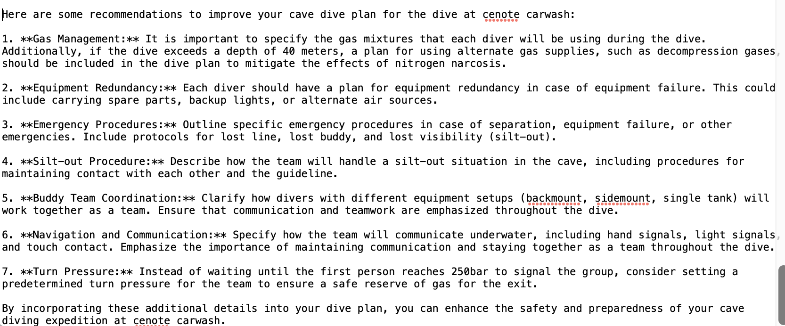

# Cave Diving Feedback

This Flask web application helps to provide feedback for technical cave divers regarding their cave dive plans. Harnessing the power of GenAI through OpenAI's application programming interface (API), this Cave Diving Feedback app has been programmed as an interactive user experience (with inputs and outputs). It should help cave divers refine their dive plans to be as safe and risk-adversive as possible.


## Table of Contents

- [Link Trees](#link-trees)
- [Requirements](#requirements)
- [Installation](#installation)
- [Usage](#usage)
- [Contributing](#contributing)
- [License](#license)  
- [Acknowledgments](#acknowledgments)


## Link Trees
### __pycache__

* [app.cpython-312.pyc](./__pycache__/app.cpython-312.pyc)
* [app.cpython-39.pyc](./__pycache__/app.cpython-39.pyc)

### static

* [cave_warning_sign.png](./static/cave_warning_sign.png)
* [NSS-CDS_icon.png](./static/NSS-CDS_icon.png)
* [recommendations.png](./static/recommendations.png)
* [main.css](./static/main.css)

- main.css: 'Cascading Style Sheets' code enhances the webpage's front-end, providing aesthetics such as color, design, and graphic features.
- cave_warning_sign.png: Screenshot of the standardized warning signs which appear at the entrances of underwater caves. 
- NSS-CDS_icon.png: Logo for NSS-CDS.
- recommendations.png: Screenshot of Sheck Exley's "Ten Recommendations for Safe Cave Diving".

### templates

* [index.html](./templates/index.html)

- index.html: 'Hyper Text Markup Language' code and tags assign structure to the webpage's back-end.


## Requirements 

- Any new server or Python environment must install all required libraries in order for Flask to run this app successfully.
- You'll only need to configure these requirements within your environment once (see ### Step 7). 
- [requirements.txt file](requirements.txt).


## Installation

Here are the steps to install the Cave Diving Feedback app and host it locally on a web server. 

### Step 1. Install Python and configure OpenAI. 
- Open Terminal (MacOS) or Command Prompt (Windows).
- Type ```python```
- If Python is already installed, nothing will happen. 
- If Python is not installed, install and configure Python at [Python Downloads](https://www.python.org/downloads/).

### Step 2. Download the OpenAI library. 
Type the command:
```pip3 install --upgrade openai```

### Step 3. Configure the OpenAI key. 
- Follow the instructions on OpenAI's webpage on configuring your OpenAI key: [OpenAI Quickstart](https://platform.openai.com/docs/quickstart?context=python).
- NOTE: Your API key should remain private. Do not share this API key with anyone. 

### Step 4. Install and configure Flask. 
Type the command: 
```pip3 install flask```

### Step 5. Unzip the cavediving folder.

### Step 6. Set your working directory to the cavediving folder. 
- Type ```cd```, followed by the routing path to the cavediving folder on your computer. 
- Copy and paste the path into Terminal or Command Prompt and press Enter.

### Step 7. Install the necessary requirements.
Type the command:
```pip3 install -r requirements.txt```

### Step 8. Initialize the database. 
Type the command:
```python3 init_db.py```

### Step 9. Run the Flask app. 
Type the command: 
```python3 -m flask --app app run```

### Step 10. View the Flask app.
- If the command has been successfully executed, your computer is now a temporary web server. 
- You may now view Cave Diving Feedback at the webpage generated by Flask.

### Step 11. Run db_test.py.
- Enter test data into Cave Diving Feedback (e.g., training agency, certification level, name, email, and dive plan content). 
- The response will render and the data should save. 
- Run db_test.py to view the test data. You'll need to stop the server to check if the response has saved successfully.

### Step 12. Congratulations!
You've successfully completed the installation.


## Usage 

Now that you've configured the app, here's information about each file contained within the project.

### app.py 

- app.py provides programming for the Flask web application that connects to OpenAI's GPT-3.5 model.
- Users input their information (choice of training agency, highest level of certification, lead diver name, email, dive plan content) and receive nearly instantaneous feedback from OpenAI's GPT-3.5 model.
- For GET requests, app.py renders the index.html template.
- For POST requests, app.py retrieves data (choice of training agency, lead diver certification level, name, email, dive plan content), sends the dive plan content to the OpenAI GPT-3.5 model for feedback, stores the form data and feedback in the SQLite database, and redirects back to the index with the generated feedback.

### database.db

- database.db stores and displays user-generated information, including the lead diver's name, email, and the cave dive plan content (as well as the date and time stamp from submission).
- 
- database.db also stores and displays responses generated through Cave Diving Feedback's OpenAI API. 
- 

### db_test.py

- db_test.py includes a script which has been designed to test the database. 
- You can execute the script within Terminal or Command Prompt to see the database contents. 
- This will help ensure the database has been configured properly and is saving information from Cave Diving Feedback.

### init_db.py

- init_db.py has been designed to initialize the SQL database (SQLite), connected to Cave Diving Feedback.
- It then connects to schema.sql to determine the appropriate structure of the database. 
- init_db.py is only meant to be used to initialize the database and start fresh. 
- CAUTION: If you run this file, it will delete all saved data in the database.

### schema.sql

- schema.sql structures the database associated with Cave Diving Feedback.
- It provides the specific syntax for SQL, including instructions on dropping tables if they exist and creating simple tables. 
- In this case, the 'diver' and 'prompts' tables store information entered into the app by users, which is found in database.db.


## Contributing 

Cave Diving Feedback will be posted to GitHub. To contribute:
1. Fork the repository.
2. Create a new branch: `git checkout -b feature-name`.
3. Make your changes.
4. Push your branch: `git push origin feature-name`.
5. Create a pull request.
Interested parties can also direct feedback/contributions to the programmer in charge of this project's continuation: [Toni Beaton](tn228036@dal.ca).


## License

This project is licensed under the [MIT License](LICENSE).


## Acknowledgments 

Cave Diving Feedback was built upon a pre-existing Flask web application called "REB Trainer," which was designed by an intern from the MI program at Dalhousie.